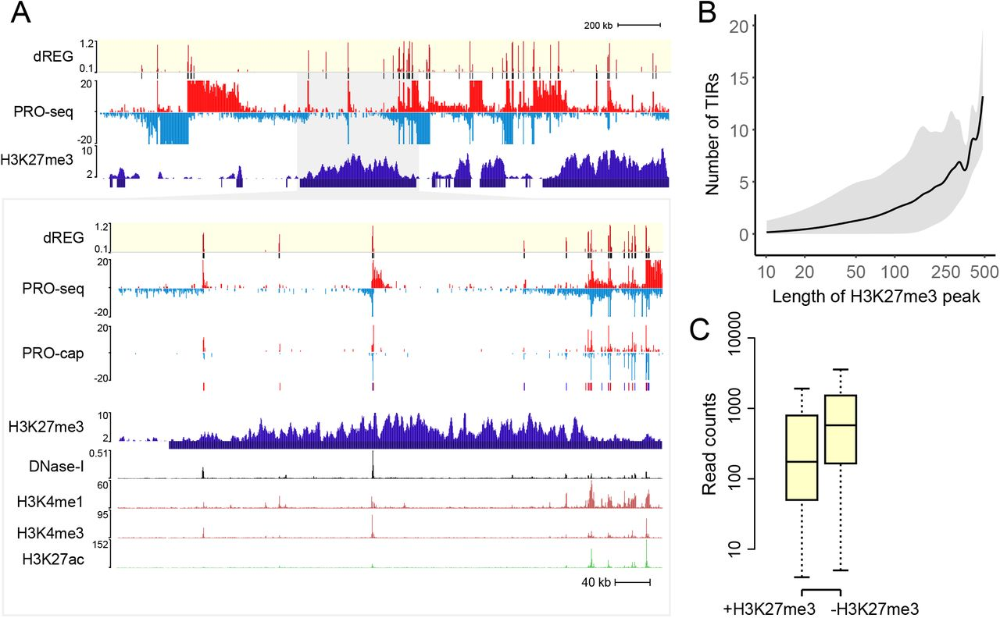

During Fall 2019, I had the opportunity to intern with CAMP4, a Cambridge-based series-A startup focused on mapping the genome-wide transcriptional machinery in different tissues to speed up the process of drug development. My primary responsibility was to develop reliable and reproducible workflows for the analysis and visualization of nascent transcription data from PROseq and SLAMseq. Both these sequencing technologies carry a wealth of information that will help us understand the mechanism of action (MOA) of drugs at the level of transcriptional regulation. 

Since these are relatively new technologies, my initial phase of work involved staying updated on relevant literature, meeting wet-lab scientists to understand the protocols involved in library preparation, performing exploratory analysis, generating reports and thereby planning future analysis plans based on it. I created a wrapper script in Awk/Bash that would call upon the needed bioinformatics and was capable of processing huge volumes of samples efficiently. The script would also generate reports on sample quality, read statistics, and adapter contamination. Based on this samples were quality controlled and processed using the proseq2 pipeline from Danko Lab. Since our major focus was on mRNA, I created additional modules that would filter any rRNA/tRNA/mtDNA/spike-ins, perform read summarization for gene body quantification, carry out normalization and comparative analysis, and generate the final bedgraph and bigwig files for UCSC tracks and peak calling. 

This was followed by motif discovery of the peaks underlying those called by dREG using HOMER and MDS concurrently. When the workflow was tested with samples from donor liver cells treated with drugs having a well-known MOA, we were able to observe significantly different transcription initiation at those motifs of the known targets. Further, when tested on a large public dataset we were able to reproduce the same results as observed by the authors of that publication. Most of this work was carried out on AWS EC2 instances and well-documented for future reference. This was also the work that I finally presented at a company-wide meeting demonstrating that it would be worth using the PROseq sequencing technology to characterize the MOA of new drugs.

Parallelly, I also streamlined the processing of epitranscriptomic data from SLAMseq studies employing metabolic labelling of RNA using a dockerized multicontainer AWS instance. The pipeline would generate alignment files, filtered files, reports on counts of nucleotide conversions from the labelling and true SNPs. The results from these studies were then checked for congruence with those from the PROseq studies. 
    
My experience here has primed me to confidently handle large datasets, learn new technologies fast on the go, rise up to challenges, meet deadlines, and routinely collaborate with scientists to exchange knowledge and feedback. It has been an incredible experience and I hope that I get similar opportunities to work in such fast-paced environments.

Source: <a href="https://www.camp4tx.com/">CAMP4</a>
