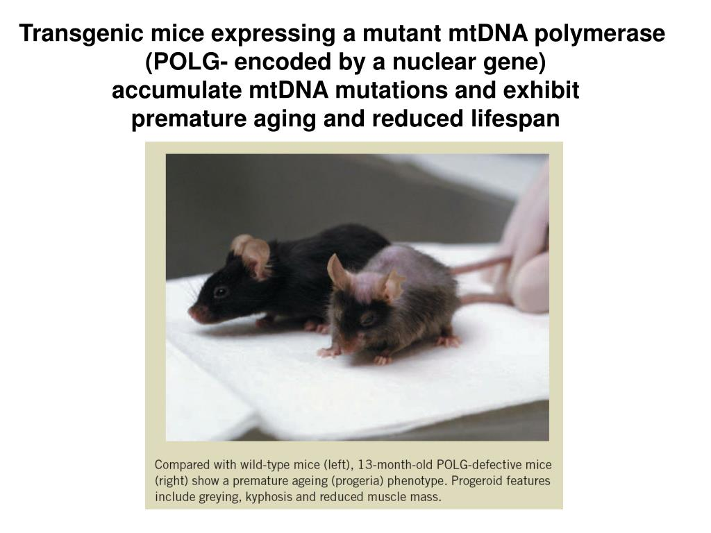

Mutations are accumulated in throughout the lifetime of the individual, and since mitochondria have an elevated mutation rate relative to the nuclear genome, a mechanism to minimize the inheritance of these detrimental mutations is of vital importance to the survival of the population. Two key concepts explain this observation:
a) Mitochondrial bottleneck: removes deleterious mtDNA from the population and limits the number of effective lineages.
b) Purifying selection: acts on the primordial germ cells to eliminate detrimental mutations
from the population.

To date temporal resolution and limitations in the characterization of mtDNA population diversity have curbed efforts to exactly determine the dynamics of this phenomenon. Hence, the Khrapko Lab uses polg mice models which are characterized by an aging phenotype and an elevated mutation rate.

Mitochondrial DNA of mature oocytes from both homozygous and heterozygous mice at different age categories were sequenced using the MinION sequencer from ONT to study the timing and mechanism of the purifying selection. I worked alongside Zoey Fleischmann, a Ph.D. graduate student from the same lab to help her with her research.

One of my assignments was to find the most suited alignment tool for the long-read data. A comparison of BLAST, ClustalW2, Muscle, MAFFT and Nanopipe. Though the MAFFT alignment was highly accurate, it was highly time consuming. Muscle and Nanopipe gave comparable results with a relatively faster performance. From the MSA, phylogenetic trees were constructed using ape in R to determine if the bottleneck occurred early or late from the shared mutations and leaf mutations on the trees. These trees help confirm that early bottleneck best mimics the oocyte population dynamics. In addition, I also helped build a module for demultiplexing the mtDNA sequence data with UMIs to delineate true mutations from PCR artifacts. This module was later incorporated into the final processing pipeline.

